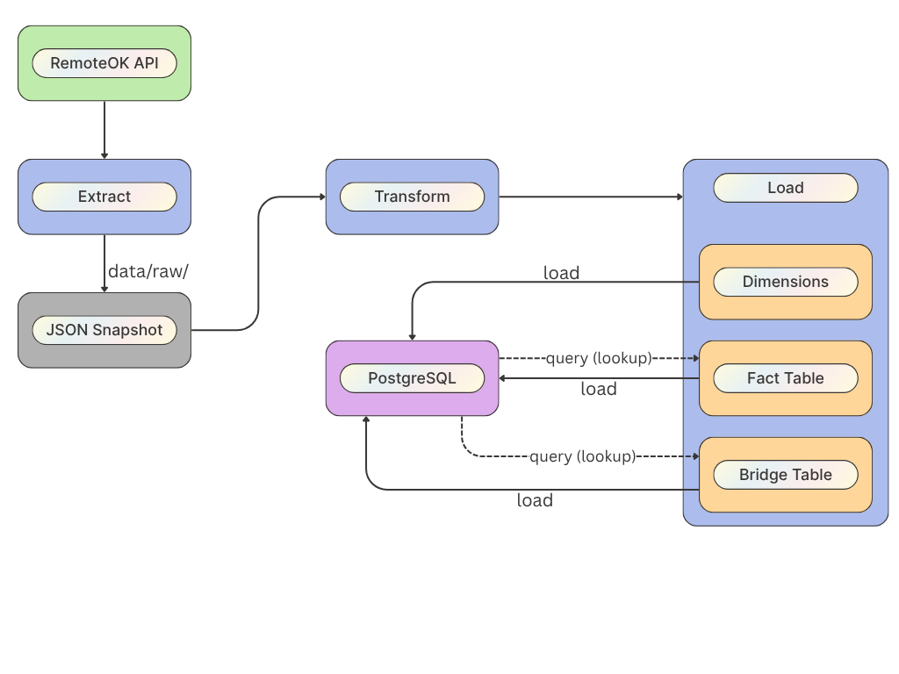
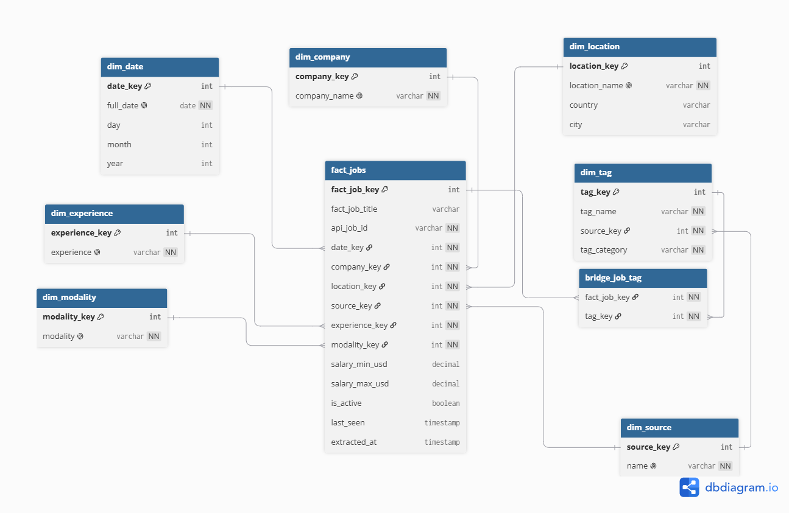

# Tech Jobs Data Pipeline

ETL pipeline that extracts tech job postings from public APIs, transforms and normalizes the data, and loads it into a PostgreSQL star schema for analysis.

---

## Stack

- **Python 3.13** — extraction, transformation, and load logic
- **PostgreSQL** — star schema with bridge table
- **psycopg2** — database connection
- **requests** — API calls
- **python-dotenv** — environment variables

---

## Architecture



1. **Extract** — calls the RemoteOK API and saves a JSON snapshot to disk with timestamp
2. **Transform** — cleans, normalizes, and enriches the raw data (locations, salaries, tags, dates)
3. **Load** — inserts into a PostgreSQL star schema using lookup tables and idempotent inserts

---

## Data Model



Key design decisions:
- `ON CONFLICT DO NOTHING` for idempotent dimension loads
- `is_active / last_seen` on `fact_jobs` to track job availability over time
- Bridge table for tag analysis without denormalization
- Single database connection with rollback on failure

---

## Project Structure

```
tech_jobs_pipeline/
├── src/
│   ├── extract/          # API extraction
│   ├── transform/        # Data cleaning and normalization
│   ├── load/             # Database loading
│   ├── model/            # Dimension builders
│   └── utils/            # DB connection, logger, mappings
├── data/
│   └── raw/              # JSON snapshots (gitignored)
├── docs/                 # Research and profiling scripts
├── sql/                  # PostgreSQL schema
├── logs/                 # Pipeline execution logs (gitignored)
├── .env                  # Credentials (gitignored)
├── requirements.txt
└── README.md
```

---

## Setup

1. Clone the repository
```bash
git clone https://github.com/Thouffcalthy/tech_jobs_pipeline.git
cd tech_jobs_pipeline
```

2. Install dependencies
```bash
pip install -r requirements.txt
```

3. Create a `.env` file in the root with your PostgreSQL credentials
```
DB_HOST=localhost
DB_PORT=5432
DB_NAME=your_database
DB_USER=your_user
DB_PASSWORD=your_password
```

4. Run the PostgreSQL schema from `sql/`

5. Run the pipeline
```bash
cd src
python main.py
```

---

## Current Status

- Extract, transform, load pipeline fully functional
- RemoteOK API integrated
- Star schema with bridge table implemented
- Logging with file and console output
- Location normalization with country mapping
- Tag classification by category

## Roadmap

- Additional API sources (Adzuna, Arbeit Now)
- Power BI dashboard
- Automated scheduling
- Unit tests